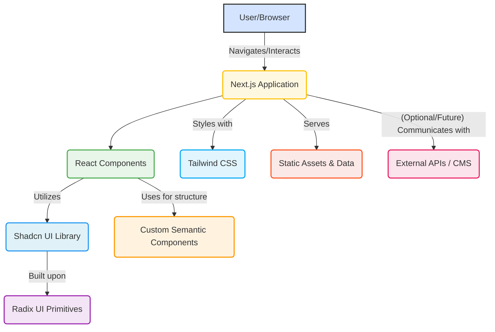

<!--
  Generated by AI-Powered README Generator
  Repository: https://github.com/GDSC-FSC/gdsc-farmingdale-website
  Generated: 2025-10-07T18:13:01.289Z
  Format: md
  Style: comprehensive
-->

# GDSC Farmingdale Website
The official online hub for Google Developer Student Clubs at Farmingdale State College, fostering a vibrant tech community.

[](LICENSE)
[](https://github.com/GDSC-FSC/gdsc-farmingdale-website/actions/workflows/main.yml)
[](package.json)
[](https://www.typescriptlang.org/)
[](https://nextjs.org/)

---

## 📖 Table of Contents
*   [🚀 Overview](#-overview)
*   [✨ Feature Highlights](#-feature-highlights)
*   [🏛️ Architecture & Technology Stack](#️-architecture--technology-stack)
    *   [High-Level Component Diagram](#high-level-component-diagram)
    *   [Technology Stack](#technology-stack)
*   [⚙️ Getting Started](#️-getting-started)
    *   [Prerequisites](#prerequisites)
    *   [Installation](#installation)
    *   [Configuration](#configuration)
    *   [Running the Application](#running-the-application)
*   [💡 Usage & Workflows](#-usage--workflows)
    *   [Common Use Cases](#common-use-cases)
    *   [Developer Workflows](#developer-workflows)
*   [🚧 Limitations, Known Issues & Future Roadmap](#-limitations-known-issues--future-roadmap)
    *   [Current Limitations](#current-limitations)
    *   [Known Issues](#known-issues)
    *   [Future Roadmap](#future-roadmap)
*   [🤝 Contributing & Development Guidelines](#-contributing--development-guidelines)
    *   [How to Contribute](#how-to-contribute)
    *   [Branching & PR Guidelines](#branching--pr-guidelines)
    *   [Code Style & Quality](#code-style--quality)
    *   [Development Setup](#development-setup)
*   [📄 License, Credits & Contact](#-license-credits--contact)
    *   [License](#license)
    *   [Credits & Acknowledgments](#credits--acknowledgments)
    *   [Contact](#contact)
*   [📚 Appendix](#-appendix)
    *   [Changelog](#changelog)
    *   [FAQ](#faq)
    *   [Troubleshooting](#troubleshooting)

---

## 🚀 Overview
The GDSC Farmingdale Website serves as the official digital home for the Google Developer Student Clubs chapter at Farmingdale State College. This application is built with Next.js, providing a fast, modern, and interactive experience for members, prospective members, and the broader college community.

**Purpose & Goals:**
The primary goals of this application are to:
*   **Centralize Information:** Provide a single, reliable source for all club-related information, including events, projects, resources, and contact details.
*   **Enhance Community Engagement:** Facilitate communication and connection within the GDSC-FSC community.
*   **Showcase Club Activities:** Highlight past and upcoming events, member projects, and achievements.
*   **Attract New Members:** Serve as an inviting platform to educate potential members about GDSC and encourage participation.
*   **Improve Accessibility:** Ensure that all information is easily discoverable and accessible to everyone.

**Why it matters / Problem it solves:**
Before this website, GDSC-FSC information might have been fragmented across various social media platforms, emails, or informal channels. This project solves the problem of information silos by offering a unified, professional, and easily navigable platform. It ensures consistency in branding and messaging, ultimately streamlining communication and enhancing the club's digital presence.

**Target Audience:**
*   **Current GDSC-FSC Members:** For staying updated on club news, events, and accessing resources.
*   **Prospective Students/Members:** To learn about GDSC-FSC, its mission, activities, and how to join.
*   **Farmingdale State College Faculty & Staff:** For insights into student activities and potential collaboration opportunities.
*   **Google Developer Student Clubs Program:** To showcase the chapter's activities and growth.

[⬆️ Back to Top](#-table-of-contents)

---

## ✨ Feature Highlights
This application is designed with user experience and developer maintainability in mind, incorporating modern web technologies and practices.

### User Experience & Navigation
*   ✅ **Intuitive Navigation:** Clean and responsive navigation menu (using `radix-ui/react-navigation-menu`) for easy access to all sections.
*   🚀 **Fast Page Loads:** Leverages Next.js for server-side rendering (SSR) and static site generation (SSG) capabilities, providing an optimized user experience.
*   🌓 **Dark/Light Mode:** Seamless theme switching (powered by `next-themes`) to cater to user preferences and improve readability in various environments.
*   🔍 **Accessible Components:** Built with Shadcn UI components, which are designed on top of Radix UI primitives, ensuring high accessibility standards.
*   🖼️ **Optimized Media:** Automatic image and asset optimization (via Next.js) for faster loading times.

### Content & Information Delivery
*   📄 **Dedicated Legal Pages:** Specific routes for `/privacy`, `/terms`, and `/accessibility` information, demonstrating commitment to transparency and compliance.
*   📰 **Dynamic Content Structure (Future):** Built to easily integrate dynamic content for events, news, and projects (currently static, but designed for future API integration).
*   🌐 **Semantic HTML:** Utilizes custom semantic components (`<Article>`, `<Section>`, `<Header>`, `<Footer>`, `<Navbar>`) for better SEO and accessibility.

### Development & Maintainability
*   💡 **Modern JavaScript Tooling:** Written in TypeScript for improved code quality, readability, and maintainability.
*   🎨 **Tailwind CSS Integration:** Highly customizable and utility-first CSS framework for rapid UI development and consistent styling.
*   📦 **Shadcn UI:** A collection of beautifully designed, opinionated, and accessible UI components that are easy to use and extend.
*   🛠️ **Linting & Formatting:** ESLint configured to maintain code quality and consistency across the codebase.
*   ⚙️ **Vercel Deployment Ready:** Optimized for seamless deployment on the Vercel platform, as is common with Next.js projects.

[⬆️ Back to Top](#-table-of-contents)

---

## 🏛️ Architecture & Technology Stack
The GDSC Farmingdale Website follows a modern frontend-centric architecture, built around the Next.js framework. This setup provides a robust foundation for a fast, scalable, and maintainable web application.

### High-Level Component Diagram
This diagram illustrates the primary components of the application and how a user interacts with them.



**Explanation of Components:**
*   **User/Browser:** The end-user interacting with the website through their web browser.
*   **Next.js Application:** The core of the application, responsible for routing, rendering pages (SSR/SSG), API routes (if any), and serving static assets. It acts as the orchestrator for the entire frontend experience.
*   **React Components:** The building blocks of the UI. These are individual, reusable pieces of the interface (e.g., buttons, cards, navigation items).
*   **Shadcn UI Library:** A collection of pre-built, accessible, and customizable UI components. Developers can copy and paste the code directly into the project, allowing for full control and customization.
*   **Radix UI Primitives:** The foundation for Shadcn UI components, providing unstyled, accessible components that handle complex UI interactions (e.g., dropdowns, dialogs, form elements).
*   **Custom Semantic Components:** Project-specific React components (`<Header>`, `<Footer>`, `<Section>`) that wrap standard HTML elements with added styling or layout logic, ensuring semantic structure and consistency.
*   **Tailwind CSS:** The styling layer of the application. It's a utility-first CSS framework that enables rapid UI development by composing classes directly in the markup.
*   **Static Assets & Data:** Images, videos, fonts, and static content (like the text for privacy policies or club descriptions) that are served directly by the Next.js application.
*   **External APIs / CMS (Optional/Future):** A placeholder for potential future integrations with backend services or Content Management Systems to provide dynamic content (e.g., event listings, blog posts, member profiles).

### Technology Stack
This project leverages a modern and robust set of technologies:

*   **Frontend Framework:**
    *   [**Next.js**](https://nextjs.org/): A React framework for building full-stack web applications, known for its performance optimizations, routing, and developer experience.
    *   [**React**](https://react.dev/): A declarative, component-based JavaScript library for building user interfaces.
*   **Language:**
    *   [**TypeScript**](https://www.typescriptlang.org/): A typed superset of JavaScript that compiles to plain JavaScript, enhancing code quality and maintainability.
*   **Styling:**
    *   [**Tailwind CSS**](https://tailwindcss.com/): A utility-first CSS framework for rapidly building custom designs.
    *   [**PostCSS**](https://postcss.org/): A tool for transforming CSS with JavaScript, used by Tailwind CSS and Autoprefixer.
    *   [**Autoprefixer**](https://github.com/postcss/autoprefixer): Automatically adds vendor prefixes to CSS rules.
*   **UI Components:**
    *   [**Shadcn UI**](https://ui.shadcn.com/): A customizable component library built on top of Radix UI and Tailwind CSS.
    *   [**Radix UI**](https://www.radix-ui.com/): A collection of unstyled, accessible UI components for building high-quality design systems.
*   **Forms & Validation:**
    *   [**React Hook Form**](https://react-hook-form.com/): A performant, flexible, and extensible forms library.
    *   [**Zod**](https://zod.dev/): A TypeScript-first schema declaration and validation library.
    *   [**@hookform/resolvers**](https://www.npmjs.com/package/@hookform/resolvers): Integrates schema validation libraries like Zod with React Hook Form.
*   **Utilities:**
    *   [**`clsx`**](https://github.com/lukeed/clsx): A tiny utility for constructing `className` strings conditionally.
    *   [**`tailwind-merge`**](https://github.com/dcastil/tailwind-merge): Merges Tailwind CSS classes without style conflicts.
    *   [**`date-fns`**](https://date-fns.org/): A modern JavaScript date utility library.
    *   [**`cmdk`**](https://cmdk.dev/): A command menu component.
*   **Development Tools:**
    *   [**ESLint**](https://eslint.org/): A pluggable linting utility for JavaScript and JSX.
    *   [**Next.js ESLint config**](https://nextjs.org/docs/basic-features/eslint): Recommended ESLint configuration for Next.js projects.

[⬆️ Back to Top](#-table-of-contents)

---

## ⚙️ Getting Started
Follow these instructions to get a copy of the project up and running on your local machine for development and testing purposes.

### Prerequisites
Before you begin, ensure you have the following installed:
*   **Node.js**: `v18.x` or higher (LTS recommended)
    *   Check your version: `node -v`
*   **npm** (Node Package Manager): `v9.x` or higher (comes with Node.js)
    *   Check your version: `npm -v`
*   **Git**: For cloning the repository.
    *   Check your version: `git --version`

<details>
<summary>💡 **Detailed Prerequisite Installation**</summary>

*   **Node.js & npm**:
    The easiest way to install Node.js (which includes npm) is to download the official installer from [nodejs.org](https://nodejs.org/). Choose the LTS version.
    Alternatively, use a version manager like `nvm` (Node Version Manager):
    ```bash
    # Install nvm (if not already installed)
    curl -o- https://raw.githubusercontent.com/nvm-sh/nvm/v0.39.7/install.sh | bash
    # Source nvm
    source ~/.bashrc # or ~/.zshrc, etc.
    # Install the latest LTS version of Node.js
    nvm install --lts
    nvm use --lts
    ```
*   **Git**:
    Follow the instructions on the [official Git website](https://git-scm.com/downloads) for your operating system.
</details>

### Installation
Clone the repository and install the project dependencies.

1.  **Clone the repository:**
    ```bash
    git clone https://github.com/GDSC-FSC/gdsc-farmingdale-website.git
    cd gdsc-farmingdale-website
    ```

2.  **Install dependencies:**
    Choose your preferred package manager:
    *   **npm**
        ```bash
        npm install
        ```
    *   **Yarn** (if installed globally)
        ```bash
        yarn install
        ```
    *   **pnpm** (if installed globally)
        ```bash
        pnpm install
        ```
    <details>
    <summary>💡 **Using pnpm for faster installation**</summary>
    `pnpm` is often faster and more efficient with disk space. If you want to use `pnpm`, install it globally first:
    ```bash
    npm install -g pnpm
    pnpm install
    ```
    </details>

[⬆️ Back to Top](#-table-of-contents)

### Configuration
Most configurations are handled through `package.json`, `tailwind.config.ts`, and `next.config.js`.

*   **Environment Variables:**
    Currently, this project does not rely on specific environment variables for basic operation. If future features require API keys or sensitive information, they would be managed via a `.env.local` file.
    *   Create a `.env.local` file in the root directory:
        ```
        # Example: API_KEY=your_api_key_here
        ```
    *   Ensure `.env.local` is listed in `.gitignore` (which it is by default in Next.js projects) to prevent it from being committed to version control.
*   **`tailwind.config.ts`**: Defines Tailwind CSS configuration, including themes, colors, and content paths.
*   **`components.json`**: Configures Shadcn UI aliases and styling preferences. The current setup uses the "new-york" style with CSS variables for theming.

[⬆️ Back to Top](#-table-of-contents)

### Running the Application

#### Development Mode
To run the application in development mode with hot-reloading:

```bash
npm run dev
# or
yarn dev
# or
pnpm dev
```
The application will be accessible at `http://localhost:3000`. Any changes you make to the code will automatically refresh the browser.

#### Production Build
To create an optimized production build of the application:

```bash
npm run build
# or
yarn build
# or
pnpm build
```
This command compiles the application into static assets and optimized JavaScript bundles in the `.next` directory, ready for deployment.

#### Running in Production (Locally)
After building the application, you can serve the production build locally:

```bash
npm run start
# or
yarn start
# or
pnpm start
```
The application will run in a production-like environment, typically on `http://localhost:3000`. This is useful for testing the final deployed version locally before actual deployment.

[⬆️ Back to Top](#-table-of-contents)

---

## 💡 Usage & Workflows
This section outlines how users interact with the deployed application and provides guidance for developers on common tasks.

### Common Use Cases

*   **Browsing Club Information:**
    *   Navigate to the homepage to see general announcements and a quick overview of GDSC-FSC.
    *   Use the navigation bar to find specific sections like "About," "Events," "Projects," or "Contact."
*   **Finding Events:**
    *   Visit the "Events" section to see upcoming workshops, meetings, and social gatherings.
    *   Click on individual event listings for details, registration links, and schedules.
*   **Accessing Legal Documents:**
    *   Links in the footer typically lead to "Privacy Policy," "Terms of Service," and "Accessibility Statement" pages.
*   **Learning About the Club:**
    *   The "About" page provides details on GDSC's mission, leadership, and how to get involved.
*   **Contacting the Club:**
    *   The "Contact" section (or footer) provides email addresses or links to social media for inquiries.

### Developer Workflows

#### Adding a New Page
1.  Create a new `page.tsx` file inside the `app/` directory, following Next.js's file-system routing conventions (e.g., `app/new-page/page.tsx`).
2.  Define your React component within this file.
3.  Add the new page to the `Navbar` component (or `constants/index.ts` if navigation links are centralized) if it needs to be accessible via the main navigation.

#### Adding a Shadcn UI Component
1.  Use the Shadcn UI CLI to add components:
    ```bash
    npx shadcn-ui@latest add <component-name>
    ```
    For example, to add an `Alert` component: `npx shadcn-ui@latest add alert`.
2.  The component code will be added to `components/ui/`. You can then import and use it in your pages or other components.

#### Styling with Tailwind CSS
*   Apply Tailwind utility classes directly in your JSX:
    ```jsx
    <div className="bg-blue-500 text-white p-4 rounded-lg shadow-md">
        This is a styled div.
    </div>
    ```
*   For complex or reusable styles, consider creating custom components or extending Tailwind's theme in `tailwind.config.ts`.

#### Working with TypeScript
*   Ensure all new files (excluding config files) are `.ts` or `.tsx`.
*   Leverage interfaces and types in `types/` for data structures and component props to maintain type safety.

#### Running Linters
The project is configured with ESLint. You can manually run the linter to check for code quality and style issues:
```bash
npm run lint
# or
yarn lint
# or
pnpm lint
```
It's recommended to integrate ESLint into your IDE (e.g., VS Code with the ESLint extension) for real-time feedback.

[⬆️ Back to Top](#-table-of-contents)

---

## 🚧 Limitations, Known Issues & Future Roadmap
Every project has areas for improvement and planned enhancements. This section outlines what the GDSC Farmingdale Website currently lacks, any known problems, and what's envisioned for its future.

### Current Limitations
*   **Static Content Management:** Most of the content (events, club descriptions, member showcases) is currently hardcoded within components or static data files. There is no dedicated Content Management System (CMS) or backend database.
    *   _Impact:_ Requires developer intervention to update core content, which can be inefficient for non-technical club members.
*   **No User Authentication/Profiles:** The website does not support user login, member profiles, or personalized experiences.
*   **Limited Dynamic Features:** While built on Next.js, current implementation relies heavily on static rendering. Features requiring real-time updates or complex server-side logic (e.g., event registration, live chat) are not yet implemented.
*   **Basic SEO (Out-of-the-box Next.js):** While Next.js provides good SEO fundamentals, there isn't extensive meta-tag management or sitemap generation specifically tailored for dynamic content (which is currently limited).
*   **No Integrated Search Functionality:** Users cannot search for specific events, projects, or information directly on the site.

### Known Issues
*   **Occasional hydration warnings in development mode:** Due to `next-themes` or specific Shadcn components, you might see client-side hydration warnings in the browser console during development. These generally do not affect production functionality or user experience.
*   **Accessibility Review Pending:** While components from Radix UI and Shadcn UI are inherently accessible, a comprehensive, site-wide accessibility audit has not yet been performed to ensure compliance with all WCAG guidelines.

### Future Roadmap
The following features and enhancements are planned for future iterations of the GDSC Farmingdale Website:

*   **Dynamic Content Management System Integration:**
    *   Integrate with a headless CMS (e.g., Strapi, Contentful, Sanity.io) or Firebase/Supabase for managing events, blog posts, member projects, and club news without code changes.
    *   Implement Next.js API routes to fetch and serve dynamic content.
*   **Event Management System:**
    *   Allow GDSC officers to add, edit, and remove events through a simple interface.
    *   Potentially integrate with external event platforms (e.g., Google Calendar, Eventbrite API).
    *   Implement RSVP or registration functionalities.
*   **Member Showcase/Portfolio:**
    *   Section for GDSC members to display their projects, skills, and contributions.
*   **Blog/News Section:**
    *   A dedicated area for club announcements, tech articles, and member stories.
*   **Enhanced SEO:**
    *   Implement dynamic meta-tag generation for each page.
    *   Generate a `sitemap.xml` and `robots.txt` automatically.
*   **Search Functionality:**
    *   Add a site-wide search bar to help users quickly find information.
*   **User Authentication (Optional/Future):**
    *   Allow members to log in for personalized content, access to exclusive resources, or event management.
*   **Performance Audits & Optimizations:**
    *   Regular Lighthouse audits to identify and address performance bottlenecks.
    *   Implement advanced caching strategies where applicable.
*   **Comprehensive Accessibility Audit:**
    *   Conduct a thorough review of the entire site to ensure maximum accessibility for all users.
*   **Automated Testing:**
    *   Integrate unit tests (e.g., with Jest/React Testing Library) and end-to-end tests (e.g., with Playwright/Cypress) to ensure reliability and prevent regressions.

[⬆️ Back to Top](#-table-of-contents)

---

## 🤝 Contributing & Development Guidelines
We welcome contributions from everyone! Whether you're a GDSC-FSC member, a student, or an open-source enthusiast, your help is valuable. Follow these guidelines to make the contribution process smooth and effective.

### How to Contribute
1.  **Fork the Repository:** Start by forking the `gdsc-farmingdale-website` repository to your GitHub account.
2.  **Clone Your Fork:** Clone your forked repository to your local machine:
    ```bash
    git clone https://github.com/YOUR_GITHUB_USERNAME/gdsc-farmingdale-website.git
    cd gdsc-farmingdale-website
    ```
3.  **Create a New Branch:** Always create a new branch for your feature or bug fix. This keeps the `main` branch clean and makes pull requests easier to manage.
    ```bash
    git checkout -b feature/your-feature-name # for new features
    # or
    git checkout -b fix/your-bug-fix-name # for bug fixes
    ```
4.  **Make Your Changes:** Implement your feature, fix the bug, or improve the documentation.
5.  **Commit Your Changes:** Write clear, concise commit messages.
    ```bash
    git commit -m "feat: Add new event listing component"
    # or
    git commit -m "fix: Resolve navigation link broken on mobile"
    ```
6.  **Push to Your Fork:** Push your changes to your repository on GitHub.
    ```bash
    git push origin feature/your-feature-name
    ```
7.  **Create a Pull Request (PR):**
    *   Go to the original `gdsc-farmingdale-website` repository on GitHub.
    *   You should see a prompt to create a pull request from your recently pushed branch.
    *   Provide a clear title and detailed description of your changes in the PR template.
    *   Reference any related issues (e.g., `Closes #123`).

### Branching & PR Guidelines
*   **Branch Naming:**
    *   `feature/<descriptive-name>` for new features.
    *   `fix/<descriptive-name>` for bug fixes.
    *   `docs/<descriptive-name>` for documentation improvements.
    *   `chore/<descriptive-name>` for maintenance tasks (e.g., dependency updates, build config).
*   **Pull Request Title:** Use a concise and descriptive title that summarizes your changes (e.g., `feat: Implement event details page`).
*   **Pull Request Description:**
    *   Explain *what* your PR does.
    *   Explain *why* these changes are necessary.
    *   Provide steps to test your changes.
    *   Include screenshots or GIFs if applicable (especially for UI changes).
*   **Review Process:** All pull requests require at least one approval from a maintainer before being merged. Be responsive to feedback and iterate on your changes.

### Code Style & Quality
*   **ESLint:** The project uses ESLint for code linting. Ensure your code passes all linting checks.
    *   Run `npm run lint` before committing.
    *   Your IDE should integrate with ESLint to show warnings/errors in real-time.
*   **TypeScript:** All new code should be written in TypeScript, leveraging its type-checking capabilities. Avoid using `any` unless absolutely necessary and with justification.
*   **Tailwind CSS:** Follow the utility-first approach of Tailwind CSS. Avoid writing custom CSS where a Tailwind utility class suffices.
*   **Shadcn UI:** When adding new UI components, use `npx shadcn-ui@latest add <component>` to ensure consistency.
*   **Accessibility:** Prioritize accessibility in your UI development. Use semantic HTML, ARIA attributes where needed, and ensure keyboard navigation works correctly.
*   **Documentation:** If you add new features or complex logic, update the relevant documentation (e.g., README, comments in code).

### Development Setup
Ensure you have followed the [Installation](#installation) steps.
Your development environment should include:
*   A code editor (VS Code recommended) with extensions for ESLint, Prettier, and TypeScript.
*   Node.js (LTS version) and npm/pnpm.

[⬆️ Back to Top](#-table-of-contents)

---

## 📄 License, Credits & Contact

### License
This project is licensed under the **MIT License**.

```
MIT License

Copyright (c) 2023 Google Developer Student Clubs | FSC

Permission is hereby granted, free of charge, to any person obtaining a copy
of this software and associated documentation files (the "Software"), to deal
in the Software without restriction, including without limitation the rights
to use, copy, modify, merge, publish, distribute, sublicense, and/or sell
copies of the Software, and to permit persons to whom the Software is
furnished to do so, subject to the following conditions:

The above copyright notice and this permission notice shall be included in all
copies or substantial portions of the Software.

THE SOFTWARE IS PROVIDED "AS IS", WITHOUT WARRANTY OF ANY KIND, EXPRESS OR
IMPLIED, INCLUDING BUT NOT LIMITED TO THE WARRANTIES OF MERCHANTABILITY,
FITNESS FOR A PARTICULAR PURPOSE AND NONINFRINGEMENT. IN NO EVENT SHALL THE
AUTHORS OR COPYRIGHT HOLDERS BE LIABLE FOR ANY CLAIM, DAMAGES OR OTHER
LIABILITY, WHETHER IN AN ACTION OF CONTRACT, TORT OR OTHERWISE, ARISING FROM,
OUT OF OR IN CONNECTION WITH THE SOFTWARE OR THE USE OR OTHER DEALINGS IN THE
SOFTWARE.
```
For the full license text, see the [LICENSE](LICENSE) file in this repository.

### Credits & Acknowledgments
We are grateful to the following projects and communities for their contributions and inspiration:
*   **Next.js:** The powerful React framework that powers this application.
*   **React:** The fundamental library for building user interfaces.
*   **TypeScript:** For providing type safety and improving developer experience.
*   **Tailwind CSS:** The utility-first CSS framework for rapid UI development.
*   **Shadcn UI:** For providing beautiful, accessible, and customizable UI components.
*   **Radix UI:** The foundation for Shadcn UI, offering unstyled, accessible primitives.
*   **Vercel:** For providing the platform for Next.js development and deployment.
*   **The open-source community:** For countless libraries, tools, and shared knowledge.

### Contact
If you have any questions, suggestions, or would like to get involved, please reach out!

*   **GitHub Repository:** [GDSC-FSC/gdsc-farmingdale-website](https://github.com/GDSC-FSC/gdsc-farmingdale-website)
*   **Google Developer Student Clubs | FSC:** [GDSC Farmingdale State College](https://gdsc.community.dev/farmingdale-state-college/)
*   **Maintainers:**
    *   (Placeholder: List GitHub usernames or team contact email, e.g., `@gdsc-fsc-team` or `gdsc.farmingdale@gmail.com`)

[⬆️ Back to Top](#-table-of-contents)

---

## 📚 Appendix

### Changelog
This section will document significant changes, new features, and bug fixes across different versions of the application.

<details>
<summary>v0.1.0 - Initial Release (YYYY-MM-DD)</summary>

*   🚀 Initial project setup with Next.js 14, React 18, and TypeScript.
*   🎨 Integrated Tailwind CSS for styling.
*   📦 Implemented Shadcn UI components for core UI elements.
*   🌓 Added Dark/Light mode toggle using `next-themes`.
*   📄 Basic page structure: Home, (main) layout, error, loading, not-found pages.
*   🛡️ Included legal pages: Privacy Policy, Terms of Service, Accessibility.
*   🔗 Setup essential configuration files: `next.config.js`, `postcss.config.js`, `tailwind.config.ts`, `components.json`.
*   ✨ Defined core semantic components: `Header`, `Footer`, `Navbar`, `Section`, `Article`.
*   🧹 Configured ESLint for code quality.
</details>

### FAQ
Here are answers to some frequently asked questions about the project.

<details>
<summary>🤔 How do I update content on the website?</summary>
Currently, most core content (e.g., descriptions, event details if not dynamically loaded) needs to be updated directly in the relevant React components or static data files within the codebase. For example, to change text on the homepage, you would edit `app/page.tsx`.

In the future, with CMS integration, content updates will be possible through a user-friendly interface without requiring code changes.
</details>

<details>
<summary>🚫 Why are there no event listings or dynamic data?</summary>
The current version of the website is primarily a static presentation layer. It's designed to be easily extendable to integrate with a backend or headless CMS. The roadmap includes plans for dynamic content management.
</details>

<details>
<summary>🌐 Can I deploy this project to another hosting provider besides Vercel?</summary>
Yes! While Next.js is optimized for Vercel, it can be deployed to any Node.js compatible environment. You can use platforms like Netlify, AWS Amplify, Heroku, or a custom server. Refer to the [Next.js Deployment Documentation](https://nextjs.org/docs/deployment) for detailed instructions.
</details>

<details>
<summary>♿ How accessible is the website?</summary>
The website uses Shadcn UI components, which are built on Radix UI primitives. Radix UI focuses heavily on accessibility, providing excellent foundations for keyboard navigation, ARIA attributes, and screen reader compatibility. However, a full, comprehensive accessibility audit for the entire site's custom content and layout has not yet been conducted. We strive to maintain high accessibility standards.
</details>

### Troubleshooting
Common issues and their solutions.

<details>
<summary>🛑 `Error: Cannot find module '...'` or missing dependencies.</summary>
This usually means that the project dependencies are not fully installed or are corrupted.
*   **Solution:** Delete your `node_modules` directory and `package-lock.json` (or `yarn.lock`, `pnpm-lock.yaml`), then reinstall:
    ```bash
    rm -rf node_modules
    rm package-lock.json # or yarn.lock, pnpm-lock.yaml
    npm install # or yarn install, pnpm install
    ```
</details>

<details>
<summary>🚨 ESLint errors prevent `npm run dev` or `npm run build`.</summary>
Next.js applications with ESLint can sometimes enforce linting during build steps.
*   **Solution 1 (Recommended):** Address the ESLint errors in your code. The error messages will guide you to the problematic lines.
*   **Solution 2 (Temporary/Override):** If you need to quickly bypass linting for a build (e.g., for testing deployment, not recommended for final code), you can modify `next.config.js`:
    ```javascript
    /** @type {import('next').NextConfig} */
    const nextConfig = {
      eslint: {
        ignoreDuringBuilds: true, // Only use this if you know what you're doing
      },
    }
    module.exports = nextConfig
    ```
    **WARNING:** Ignoring ESLint during builds can lead to quality issues. Only use this for temporary debugging.
</details>

<details>
<summary>🔄 Changes are not reflected after saving files.</summary>
*   **Solution 1:** Ensure your development server is running (`npm run dev`).
*   **Solution 2:** Sometimes the HMR (Hot Module Replacement) can get stuck. Try restarting the development server (`Ctrl+C` then `npm run dev`).
*   **Solution 3:** Clear your browser cache or try a hard refresh (`Ctrl+Shift+R` or `Cmd+Shift+R`).
</details>

[⬆️ Back to Top](#-table-of-contents)